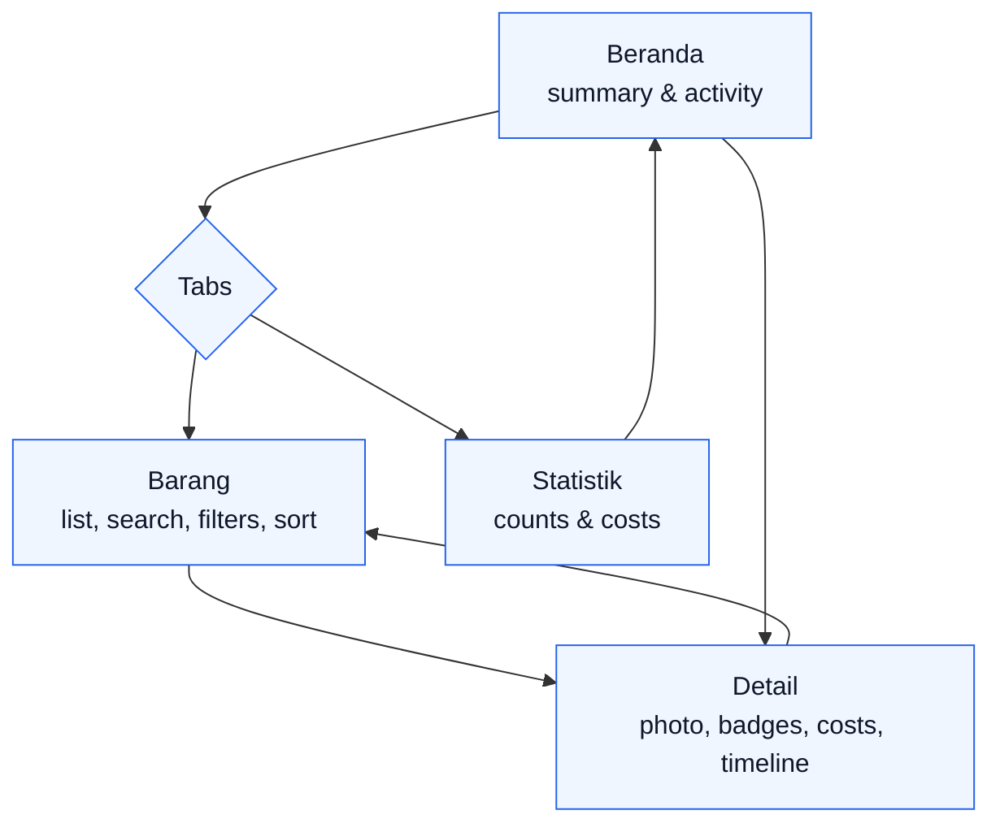
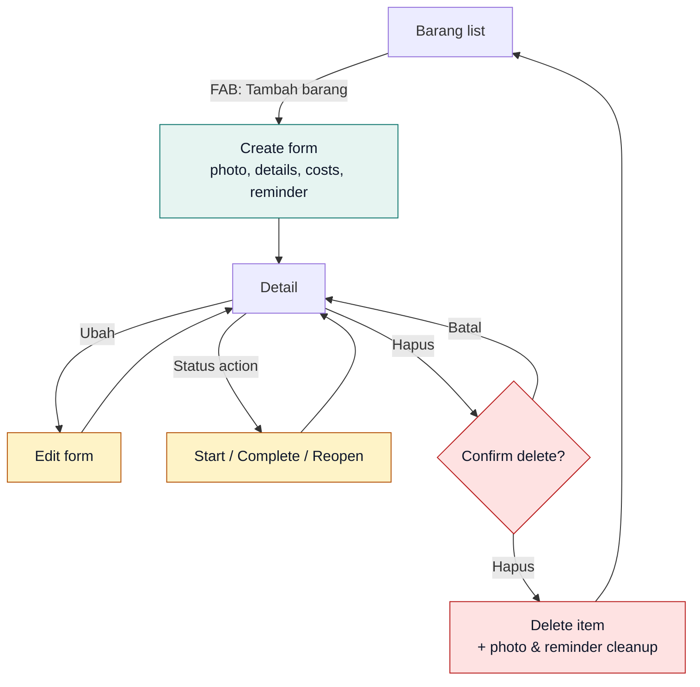
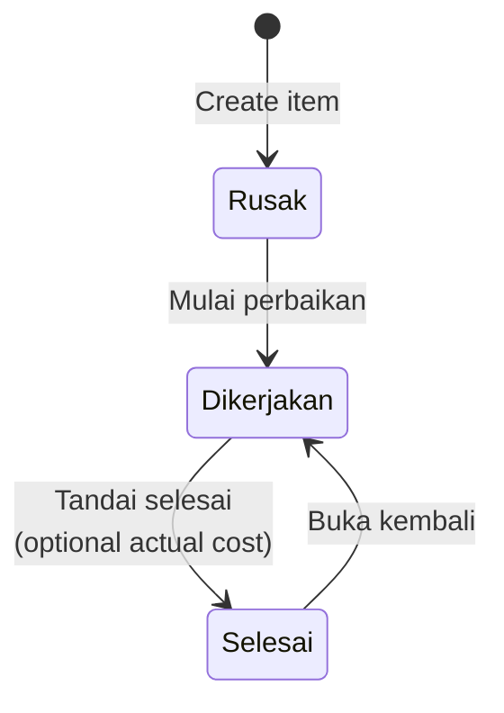

# KosFix — App Flow

Mermaid source for the KosFix flowcharts. GitHub renders the diagrams below.

## Navigation and read flow

```mermaid
flowchart TD
  Home[Beranda<br/>summary & activity] --> Tabs{Tabs}
  Tabs --> Items[Barang<br/>list, search, filters, sort]
  Tabs --> Stats[Statistik<br/>counts & costs]
  Items --> Detail[Detail<br/>photo, badges, costs, timeline]
  Home --> Detail
  Detail --> Items
  Stats --> Home

  classDef read fill:#EFF6FF,stroke:#2563EB,color:#0F172A;
  class Home,Tabs,Items,Stats,Detail read;
```

## Create, update, and delete flow

```mermaid
flowchart TD
  Items[Barang list] -->|FAB: Tambah barang| Create[Create form<br/>photo, details, costs, reminder]
  Create --> Detail[Detail]
  Detail -->|Ubah| Edit[Edit form]
  Edit --> Detail
  Detail -->|Status action| Status[Start / Complete / Reopen]
  Status --> Detail
  Detail -->|Hapus| Confirm{Confirm delete?}
  Confirm -->|Batal| Detail
  Confirm -->|Hapus| Delete[Delete item<br/>+ photo & reminder cleanup]
  Delete --> Items

  classDef create fill:#E6F4F1,stroke:#0F766E,color:#0F172A;
  classDef update fill:#FEF3C7,stroke:#B45309,color:#0F172A;
  classDef delete fill:#FEE2E2,stroke:#B91C1C,color:#0F172A;
  class Create create;
  class Edit,Status update;
  class Confirm,Delete delete;
```

## Repair status transitions

```mermaid
stateDiagram-v2
  [*] --> Rusak: Create item
  Rusak --> Dikerjakan: Mulai perbaikan
  Dikerjakan --> Selesai: Tandai selesai<br/>(optional actual cost)
  Selesai --> Dikerjakan: Buka kembali
```
